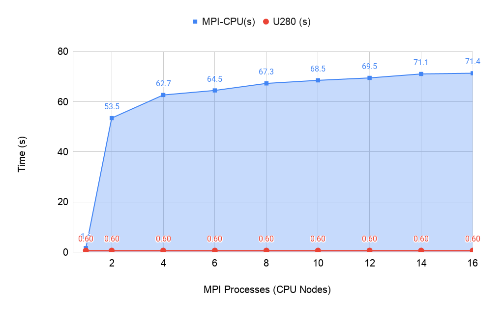
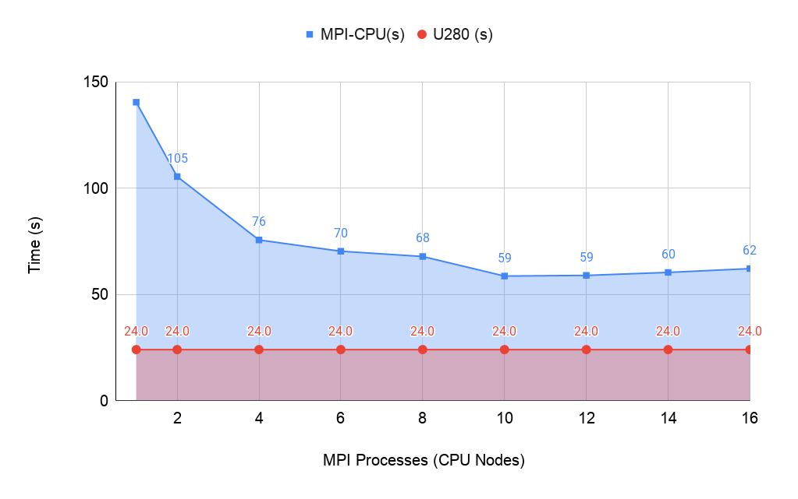
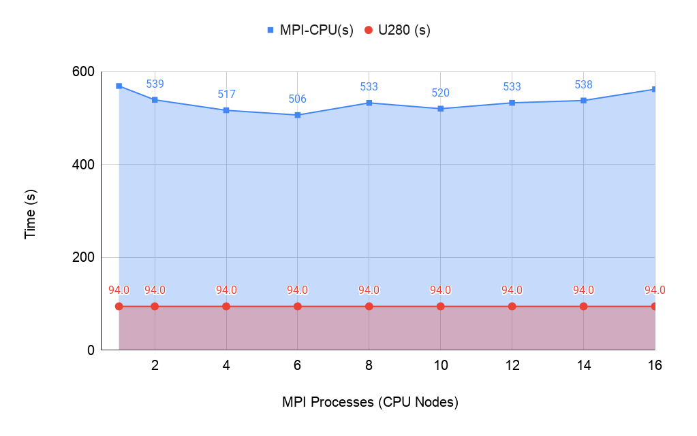
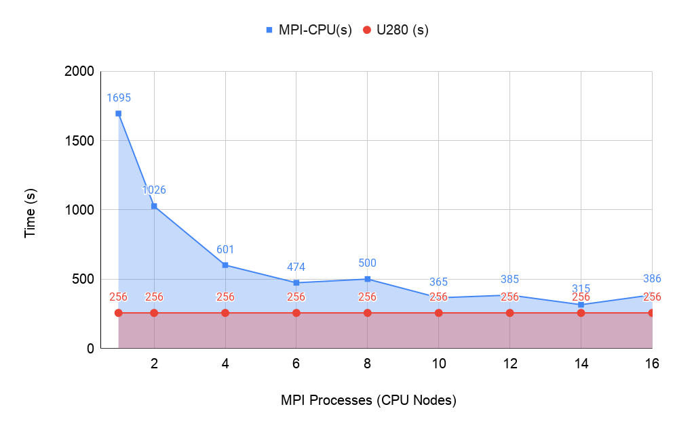

# **RTM3D-SW: Accelerating Seismic Modeling with Alveo U280 FPGA**

Reverse Time Migration (RTM) is an imaging technique widely used in the Oil&Gas industry as part of their Seismic Survey workflows. A Seismic Survey is a "method of investigating subterranean structures, particularly as related to exploration for petroleum, natural gas, and mineral deposits."[1].  A Seismic Survey has two main components: 

- **Source**: usually an explosive device positioned at a specific location to inject artificial pressure waves into the analyzed domain; 
- **Receivers**: a collection of hydrophones that used for measuring reflected waves and generating a seismic dataset called **Shot Record**.

By solving the wave-equation it is possible to simulate the propagation of a **Source Wavefield**, which initiates with the explosion of the source device and spreads across the analyzed medium in a time-forward direction. Alternatively, it is also possible to reconstruct the same wavefield in reverse order by starting from the pressure data collected by the receivers and in a time-backward direction (**Receiver Wavefield**).

An RTM Algorithm can generate a subsurface image by cross-correlating an artificial Source wave with real-world Receiver wave at equal time and space coordinates, thus highlighting constructive interference at reflection points. Any RTM implementation would then require a mechanism for generating a source wave and a Shot Record as input. However, real-world Shot Records are often large and hard-to-get datasets. The capacity for generating synthetic Shot Records is fundamental for any efficient RTM design and verification processes. By using synthetic seismic data, the researcher can test different acquisition geometries and workload sizes, which can be crucial for identifying algorithm bottlenecks and saving prototyping time before diving into real-world datasets.

## **RTM3D-SW Implementation:**

This repository contains and 3D Acoustic RTM implementation (RTM3D-SW) and a set of bash scripts that help to compile and test its performance. Our RTM3D-SW implementation is based on a 3D acoustic wave equation solved with a second-order finite-differences operator. The equation is used for modeling P-waves propagation only. The propagation medium is represented by a 3D grid containing the sound propagation velocities for different materials (i.e. water, sand, salt, etc.). Finally, we use a Hybrid Boundary Condition (HBC) [2] as our virtual boundary strategy for absorbing energy that flows outside the analyzed domain.

Our RTM3D-SW program is capable of generating **synthetic seismic data** (Seismic Modeling Process) and Reverse-Time Migrating Shot Records for subsurface imaging.  In the Seismic Modeling process, the source wave is propagated across the velocities grid in time-forward direction. A Shot Record is generated by collecting pressure values at specific points according to an acquisition geometry. The Migration process (RTM), by its turn, is split into two phases: RTM Forward propagation (same as Seismic Modeling) and RTM Backward propagation, where the cross-correlation image condition is applied to form a subsurface image.

The program also implements a domain decomposition strategy for multinode execution using MPI. For multinode runs, the analyzed volume is partitioned among N processes with overlapping halo regions. The 3D seismic volume is decomposed into N block domains in the XY plan, as shown in Figure 1. All blocks have the same depth (NZ), each process rank runs the wave propagation simutalion on its block on a separate CPU-node. Each block computation is performed using 72 parallel threads, while halo regions are exchanged by MPI at every time step. The need to exchange halo regions at every time step can significantly decrease performance performance for small velocity models, where MPI calls can reach up to 60% of execution time. 

|  Figure 1: Halo-based Domain Partioning |
| :------------: |
|  |

RTM3D-SW can be accelerated by either FPGA or GPU kernels. Table 1 summarizes which routines are currently implemented for each accelerator and the MPI version. The user can choose whether using an accelerator or not during compilation time.

**Table 1**
|  Accelerator | RTM Forward   |   RTM Backward | Seismic Modeling   |
| :------------: | :------------: | :------------: | :------------: |
|  **FPGA** |  Yes | N  | N  |
|  **GPU**  |  Yes | Yes  | Yes|
|  **MPI**  |  Yes | Yes  | Yes|

The following sections describe how the repository is organized, as well as how to run the demonstration scripts and observe the output results.

## **Folder structure:**

- **data/velmodels/** : This folder contains four benchmark velocity models and their corresponding parameters file (input.json). Velocity models are stored into binary files for direct access using single-precision float representation. Each velocity model binary file includes sonic velocity values varying from 1500 to 7000 m/s, with different 3D grid sizes. Along with each velocity model we include a set of .json files with parameters that describe model dimensions, acquisition geometry and other software configuration. These input files also determine whether a migration or a modeling process is to be executed.
- **data/kernel/ :** This folder includes a set of pre-compiled FPGA kernels for RTM3D forward propagation.
- **source/ :** This folder contains the source code of RTM3D-SW program implementation. It includes HOST program for FPGA and GPU, as much as the GPU cuda-kernels.
- **data/cwp/** : This folder includes an implementation of the MIT''s CWP/SU library. This library offers a series of tools for visualizing the output data generated by the RTM3D-SW program.
- **script/:** This folder contains automatization scripts for building and running the main source code with different acceleration platforms.
- **rundemo.sh :** This bash script can be used to build and run the RTM tests for CPU, FPGA and GPU.
- **nplot.sh :** This bash script can be used for visualization of the synthetic data and the RTM images generated by the program.
- **initenv.sh :** This bash script must be used for downloading the necessary input data and pre-compiled kernels.

## **Run Demonstration Script Help(rundemo.sh):**
- **Usage:**
    rundemo.sh [options]  
- **Build Options:**
>        --build=<Y/n>
>            Builds the source code or not.
>        --target=<fpga/gpu/cpu/mpi>
>            Defines the target acceleration platform. By default, the FPGA target uses the 
>            'rtmforward_maxY128_maxZ512_b16_nPEZ4_nPEX2_nFSM2.xclbin'  
>            pre-built kernel.
>        --json=<path_to_json>
>            Path to velocity model parameters json file.
>        --nproc=<N>
>            Defines the number of process for a MPI-based multinode run.
>        --xclbin=<path_to_xclbin>
>            Path to pre-built .xclbin FPGA kernel file. 
>        --help= prints this man page.

## **Velocity Models:**

We have included four 3D velocity models with different dimensions for Acoustic RTM evaluation:

		+ 3LAYERS_64x74x84/
			Description:	Small size simple 3-layer model for quick performance tests.
			Dimensions:     64x74x84
			Virtual Border: 16
			Time steps:     512
		+ SEG-EAGE-214x214x210/
			Description:	Medium size SEG-EAGE model.
			Dimensions:     214x214x210
			Virtual Border: 21
			Time steps:     2368
		+ OVERTHRUST_402x242x432/
			Description:	Large SEG-EAGE-OVERTHRUST model.
			Dimensions:     402x242x432
			Virtual Border: 16
			Time steps:     3224
		+ SEG-EAGE-676x676x210/
			Description:	Large SEG-EAGE benchmark model.
			Dimensions:     676x676x210
			Virtual Border: 21
			Time stpes:     3300

        
## **Running an example test:**

To run an RTM test, first we must generate synthetic modeling data for the desired model. For generating synthetic modeling data we use the 'input_mod.json' file placed inside each model's folder. The modeling file tells the program to generate a synthetic seismic record for a shot positioned in the center of the top plane of the model.

The following command generates a shot record for SEG-EAGE-214x214x210 model using the CPU platform (single process).

> ./rundemo.sh --target=cpu --json=data/velmodels/SEG-EAGE-214x214x210/input_mod.json --build=y

The program will generate a synthetic seismogram for a shot positined at coordinates     107x107x0. The seismogram file is stored inside the "data/output/SEG-EAGE-214x214x210/seism" folder.

To visualize the generated seismogram, use the 'nplot.sh' script like this:

> ./nplot.sh data/output/SEG-EAGE-214x214x210/seism/RTMSEISMOGRAM_S107x107x0_NXNY_214x214_NTSTART0_NTSTEP2368.seism 214 214 2368

A shot record should normally look like this:

To run a migration test for the same model, just provide the input_mig.json file to the 'rundemo.sh' script.

> ./rundemo.sh --target=fpga --json=data/velmodels/SEG-EAGE-214x214x210/input_mig.json --build=y

This will generate an output RTM image in "data/output/SEG-EAGE-214x214x210/output-hbc/RTMIMG_SEGSALT-RESAMPLED-3D_NS1_NXNYNZ_214x214x210_NT2368.bin.NP1". To visualize the RTM image use the "nplot.sh" command as before:

> ./nplot.sh data/output/SEG-EAGE-214x214x210/output-hbc/RTMIMG_SEGSALT-RESAMPLED-3D_NS1_NXNYNZ_214x214x210_NT2368.bin.NP1 214 214 210

If you have multiple CPU nodes available, you can run a distributed version using MPI by calling:

> ./rundemo.sh --target=mpi --nproc=10 --json=data/velmodels/SEG-EAGE-214x214x210/input_mod.json --build=y

This will run Seismic Modeling process for the SEG-EAGE-214x214x210 model using 10 CPU nodes.

## Quick Performance Comparison: FPGAxCPU

We have compared the execution time of the Seismic Modeling process using a single U280 board against the MPI version. The idea was to determine how many CPU nodes are necessary to achieve the performance results provided by the U280 accerator. We ran the Seismic Modeling process first on a single U280 board and measured its execution time for each velocity model. Later, we ran the Seismic Modeling flow distributed accross 1 up to 16 MPI processes, with each process running on a different CPU node. All CPU nodes had the same hardware/software configuration:

- **CPU Node Configuration:**
> 			Architecture:          x86_64
> 			CPU(s):                72
> 			On-line CPU(s) list:   0-71
> 			Thread(s) per core:    2
> 			Core(s) per socket:    18
> 			Socket(s):             2
> 			CPU family:            6
> 			Model:                 85
> 			Model name:            Intel(R) Xeon(R) Gold 6240 CPU @ 2.60GHz
> 			Virtualization:        VT-x
> 			L1d cache:             32K
> 			L1i cache:             32K
> 			L2 cache:              1024K
> 			L3 cache:              25344K
> 			Interconnect:	       InfiniBand
> 			RAM: 	               376 GB
> 			Distributed FS:        Lustre

We measured time execution time for each MPI run and plotted the results in Figure 2.

**Figure 2:**
| a) **3LAYERS_64x74x84** | b) **SEG-EAGE-214x214x210** |
| :------------: | :------------: |
|  |  |
| c)  **OVERTHRUST_402x242x432** | d) **SEG-EAGE-676x676x210** |
|  |  |

It's worth to keep in mind, however, that the halo-based decomposition strategy degrades the performance for small velocity models due the overhead of MPI transfers at each time step. For small models such as 3LAYERS_64x74x84 and SEG-EAGE-214x214x210, MPI transfers can reach up to 60% of the execution time, thus adding more nodes actually decreases performance. For larger models, where the Computing/Network relation is more balanced, we can observe an improvement on execution time as we add more CPU nodes. Nevertheless, U280 provides higher performance for these models regardless of the number of MPI process in the CPU execution.

## Quick Performance Comparison: FPGAxGPU

We have also measured the execution time of our Seismic Modeling process for both FPGA and GPU accelerators. The goal was to provide a comparative performance analysis between these two acceleration technologies and have a better insight of their potentials and drawbacks. Our comparison considered three different performance aspects:

**i)** Quality of the Shot Record output produced by the two devices;
**ii)** Execution time;
**iii)** Energy consumption;

The devices chosen for testing were Xilinx's U280 FPGA acceleration card and NVidia's Tesla V100 GPU, both with 32GB of DDR4 as global memory. The U280 board also provides an extra 8GB of HBM2 memory.

Here are the output generated by FPGA and GPU for the **SEG-EAGE-214x214x210** velocity model:

|  **U280 FPGA** | **V100 GPU** |
| :------------: | :------------: |
|  |  |

In terms of execution time, V100 runs faster for all evaluated models. Here are the results:

We have also measured power samples using each device's own housekeeping system. Power samples were collected during the execution time at 1 sample/second rate. The power samples were then using to compute the energy consumption measurement in Watt hour (Wh). Here are the results:

U280 FPGA requires much less energy to complete the same workload! This can be compelling considering that power costs in HPC are significant, and that U280 boards usually cost half of the price of a V100!

## References

[1] https://www.britannica.com/science/seismic-survey

[2] Liu, H., Ding, R., Liu, L., & Liu, H. (2013). Wavefield reconstruction methods for reverse time migration. Journal of Geophysics and Engineering, 10(1), 015004.
